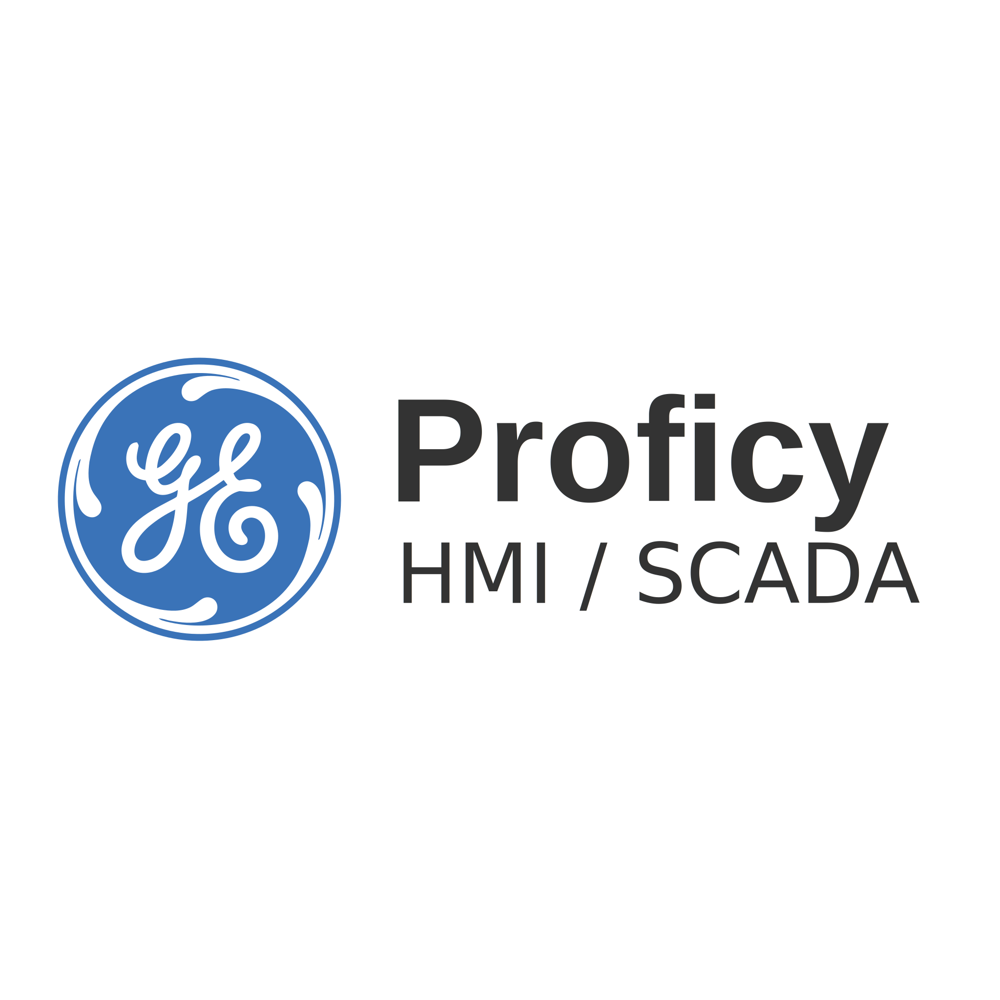

## 👋 ¡Hola!

Soy <strong>Ezequiel</strong>, un apasionado del mundo de la tecnología y el desarrollo de software. Como <strong>Analista Programador</strong> y <strong>Licenciado en Informática</strong> recibido en la <a src="https://www.unp.edu.ar/">UNPSJB</a>, he estado inmerso en el área de tecnología desde 2010, contribuyendo a proyectos diversos y desafiando los límites de la innovación. Mi <strong>compromiso con el aprendizaje</strong> continuo es evidente: me mantengo al día con las últimas tendencias y tecnologías emergentes. Ya sea explorando lenguajes de programación, arquitecturas de sistemas o metodologías ágiles. Mi <strong>capacidad para adaptarme</strong> y aplicar nuevos conceptos en mi trabajo diario es un activo valioso para cualquier equipo. En mi tiempo libre, disfruto de la lectura técnica y la <strong>investigación independiente</strong>. Exploro temas que me interesan profundamente, como algoritmos, diseño de software y buenas prácticas de desarrollo. <strong>Mi pasión por la tecnología sigue siendo una parte integral de mi carrera</strong> y una fuente constante de inspiración y crecimiento personal.

# Desarrollo de software

## 🛠️Tecnologías utilizadas

#### Lenguajes de programación:

    
    
    
    
    
    
    
    
    
    
    
    
    

#### Bases de datos:

    
    
    
    
    

#### Editores/IDE:

    
    
    
    
    
    

#### Framework

    
    
    
    
    
    
    
    
    
    
    
    
    
    
    
    
    
    

# 🤖Automatización

    
    
    
    

# Mis estadísticas de Github:

&nbsp;
